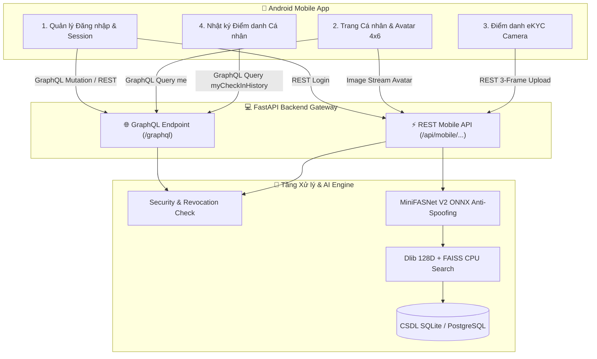
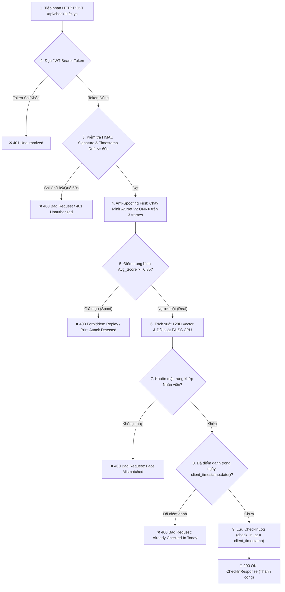

# 📱 CHUẨN KẾT NỐI & LUỒNG DỮ LIỆU GIỮA ANDROID APP VÀ BACKEND (DATA FLOW SPECIFICATION)

Tài liệu này mô tả chi tiết toàn bộ luồng dữ liệu (Data Flow), giao thức bảo mật và quy chuẩn kết nối giữa **Ứng dụng Android (Client App)** và **Hệ thống Backend API (FastAPI + AI Engine + GraphQL)**.

---

## 🏛️ 1. Kiến trúc Tổng quan (Hybrid Architecture: GraphQL + REST API)

Hệ thống áp dụng mô hình kiến trúc song song linh hoạt **Hybrid Architecture**:



---

## 🔑 2. Luồng 1: Đăng nhập & Duy trì Phiên ("Đăng nhập 1 lần rồi quên")

### Mô tả Luồng Dữ liệu:
1. Người dùng mở App lần đầu, nhập **Tên tài khoản / Mã nhân viên** và **Mật khẩu**.
2. App gửi Yêu cầu Đăng nhập:
   - **REST API**: `POST /api/mobile/auth/login` (Content-Type: `application/x-www-form-urlencoded`)
   - **Hoặc GraphQL Mutation**:
     ```graphql
     mutation Login($username: String!, $password: String!) {
       login(username: $username, password: $password) {
         accessToken
         refreshToken
         user {
           id
           name
           employeeCode
         }
       }
     }
     ```
3. Backend xác thực thông tin $\rightarrow$ Cấp cặp Token:
   - `access_token`: Hạn dùng 7 ngày.
   - `refresh_token`: Hạn dùng 30 ngày.
4. App Android lưu cặp Token vào **`EncryptedSharedPreferences`**.
5. **Cơ chế Tự động Gia hạn (Refresh Token)**:
   Khi `access_token` hết hạn (nhận mã lỗi `HTTP 401 Token Expired`), App tự động gọi `POST /api/mobile/auth/refresh` với `refresh_token` để nhận cặp Token mới mà không làm gián đoạn người dùng.
6. **Cơ chế Thu hồi Quyền tức thì (Instant Revocation Check)**:
   Mọi Yêu cầu dùng Token đều được Backend đối soát với CSDL:
   - Nếu Tài khoản bị khóa (`is_active = False`) $\rightarrow$ Từ chối `HTTP 401`.
   - Nếu Mật khẩu vừa bị đổi $\rightarrow$ Từ chối `HTTP 401` (App tự xóa token và đưa về màn hình Đăng nhập).

---

## 📸 3. Luồng 2: Điểm danh eKYC Tự động (eKYC Check-In Flow) ⭐

### Mô tả Luồng Dữ liệu:
1. Mỗi buổi sáng, nhân viên mở App và bấm **"Điểm danh"**.
2. App Android tự động:
   - Chụp **đúng 3 khung ảnh JPEG** ngẫu nhiên từ luồng Camera Active Liveness (mỗi ảnh max 1080p).
   - Đọc thời gian hiện tại theo UTC ISO 8601 (`X-Timestamp`: `2026-07-21T07:59:58Z`).
   - Tạo chuỗi UUID ngẫu nhiên (`X-Nonce`: `c8f1e0d2-7b3a-4f51-b8d9-9a2c1e0f3b4c`).
   - Tính toán Chữ ký: `X-Signature = HMAC-SHA256(SECRET_KEY, X-Timestamp + X-Nonce + user_id)`.
3. App gửi Request Multipart lên REST API Endpoint:
   - **URL**: `POST /api/mobile/check-in/ekyc`
   - **Headers**:
     - `Authorization: Bearer <access_token>` (Không cần gửi user_id trong Form).
     - `X-Timestamp`, `X-Nonce`, `X-Signature`.
   - **Files**: 3 tệp ảnh JPEG (`files`).

### Các Bước Xử lý Phía Backend:


---

## 👤 4. Luồng 3: Trang Cá nhân & Tải Ảnh Đại diện 4x6 (Profile & Avatar)

### Mô tả Luồng Dữ liệu:
1. Tại tab Cá nhân trên App Android, App gửi **GraphQL Query**:
   ```graphql
   query GetMyProfile {
     me {
       id
       name
       employeeCode
       username
       email
       gender
       dob
       hasRegisteredFace
       avatarUrl
     }
   }
   ```
2. Backend tự đọc `user_id` từ Token $\rightarrow$ Trả về thông tin cá nhân.
3. **Hiển thị Ảnh Đại diện (Avatar 4x6)**:
   App Android sử dụng thư viện `Glide` hoặc `Coil` để nạp ảnh trực tiếp từ REST API:
   - **URL**: `GET /api/mobile/personal-info/avatar`
   - **Header**: `Authorization: Bearer <access_token>`
   - Backend trả về file ảnh chân dung 4x6 đã được AI crop sẵn (`image/jpeg`).

---

## 📅 5. Luồng 4: Xem Lịch sử Điểm danh Cá nhân (Check-in History)

### Mô tả Luồng Dữ liệu:
1. Tại màn hình Lịch sử Điểm danh trên App Android, App gửi **GraphQL Query**:
   ```graphql
   query GetMyHistory($startDate: Date, $endDate: Date) {
     myCheckInHistory(startDate: $startDate, endDate: $endDate) {
       id
       checkInAt
       checkInDate
     }
   }
   ```
2. Backend lọc ra danh sách các ngày nhân viên đó đã điểm danh thành công trong khoảng thời gian `startDate` đến `endDate` và trả về kết quả JSON.

---

## 🚨 6. Bảng Tra cứu Mã Lỗi HTTP & Hướng Xử lý phía Android

| HTTP Status | Chi tiết Thông báo Lỗi | Nguyên nhân Kỹ thuật | Hướng xử lý phía App Android |
| :--- | :--- | :--- | :--- |
| **`401 Unauthorized`** | `Token has expired` | Access Token đã hết hạn 7 ngày. | Tự động gọi `POST /api/mobile/auth/refresh` bằng `refresh_token` để lấy token mới. |
| **`401 Unauthorized`** | `Invalid Request Signature (HMAC mismatched)` | Chữ ký mã hóa HMAC sai hoặc request bị sửa đổi. | Kiểm tra lại `SECRET_KEY` và thuật toán ghép chuỗi ký `timestamp + nonce + user_id`. |
| **`401 Unauthorized`** | `Password was changed / Account inactive` | Mật khẩu vừa bị thay đổi hoặc tài khoản bị Admin khóa. | Tự động xóa Token trong máy và chuyển người dùng về màn hình **Đăng nhập**. |
| **`400 Bad Request`** | `Client timestamp drift excessive (> 60s)` | Giờ hệ thống Android bị lệch quá 60s so với giờ chuẩn Internet / Server. | Hiển thị thông báo yêu cầu người dùng bật **"Tự động cập nhật giờ qua mạng (NTP)"** trong Cài đặt Android. |
| **`403 Forbidden`** | `eKYC Anti-Spoofing Rejected` | **Phát hiện Giả mạo**: Người dùng giơ ảnh in hoặc màn hình điện thoại/video. | Hiển thị thông báo yêu cầu người dùng đưa khuôn mặt thật vào camera và chụp lại. |
| **`400 Bad Request`** | `User has already checked in today` | Nhân viên hôm nay đã điểm danh rồi. | Thông báo người dùng đã hoàn thành điểm danh trong ngày. |
